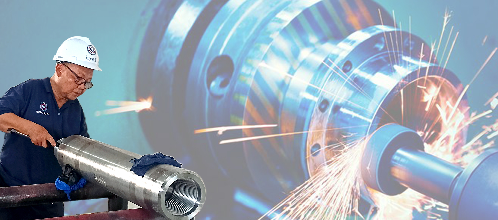

<!DOCTYPE html>
<html lang="id">
<head>
    <meta charset="UTF-8">
    <meta name="viewport" content="width=device-width, initial-scale=1.0">
    <title>PT. CIP Energi - Geothermal & Oilfield Equipment</title>
    <link href="https://cdnjs.cloudflare.com/ajax/libs/tailwindcss/2.2.19/tailwind.min.css" rel="stylesheet">
    
    
</head>
<body class="bg-gray-50" x-data="{ open: false }">
    <!-- Navigation -->
    <nav class="bg-blue-900 text-white shadow-lg fixed w-full z-50">
        

            <h1 class="text-2xl font-bold">PT. CIP Energi</h1>
            

                <a href="#home" class="hover:text-blue-200">Home</a>
                <a href="#about" class="hover:text-blue-200">About</a>
                <a href="#products" class="hover:text-blue-200">Products</a>
                <a href="#contact" class="hover:text-blue-200">Contact</a>
            

            <button @click="open = !open" class="md:hidden focus:outline-none" aria-label="Toggle Menu">
                <svg xmlns="http://www.w3.org/2000/svg" class="h-6 w-6" fill="none" viewBox="0 0 24 24" stroke="currentColor">
                    <path stroke-linecap="round" stroke-linejoin="round" stroke-width="2" d="M4 6h16M4 12h16m-7 6h7" />
                </svg>
            </button>
        

        

            <a href="#home" class="block px-4 py-2 hover:bg-blue-700">Home</a>
            <a href="#about" class="block px-4 py-2 hover:bg-blue-700">About</a>
            <a href="#products" class="block px-4 py-2 hover:bg-blue-700">Products</a>
            <a href="#contact" class="block px-4 py-2 hover:bg-blue-700">Contact</a>
        

    </nav>

    <!-- Hero Section -->
    <header id="home" class="relative min-h-screen flex items-center pt-16">
        

            
        

        

        

            

                <h2 class="text-6xl font-extrabold text-white drop-shadow-lg mb-6 leading-tight">
                    Geothermal & Oilfield Equipment Solutions
                </h2>
                

                    Leading provider of high-quality equipment and reliable service since 2010
                

                <a href="#contact" 
                   class="bg-white text-blue-900 px-10 py-4 rounded-full font-semibold hover:bg-blue-100 
                   inline-block transform hover:scale-105 transition-transform duration-300">
                    Get Started
                </a>
            

        

    </header>

    <!-- Remaining Sections -->
    <!-- About, Products, Contact, and Footer sections remain unchanged -->

</body>
</html>
